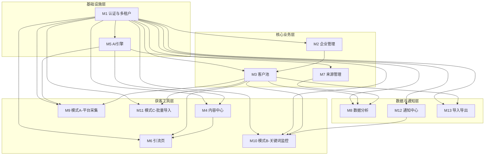

# GrowthAI Lead Engine — 业务架构方案

- 生成人：Qoder by 庄园
- 版本：v1
- 生成日期：2026-07-21

---

## 一、业务概述

### 1.1 项目背景

GrowthAI Lead Engine 是一款面向中小企业的新媒体AI获客SaaS平台。当前中小企业在抖音、小红书、视频号、公众号、朋友圈等新媒体渠道上获取客户线索面临三大痛点：**内容生产效率低、咨询承接不及时、线索管理靠人肉**。本平台通过AI内容生成 + 智能引流页 + 自动化客户池管理，构建从"内容发布"到"销售成交"的完整获客闭环。

### 1.2 核心业务目标

构建企业获客的**双向闭环引擎**：

| 方向 | 路径 | 核心价值 |
|------|------|----------|
| **被动获客（Inbound）** | 企业发布内容 → 客户主动咨询 → 引流页承接 → 自动入库 | 让客户主动找上门 |
| **主动获客（Outbound）** | 系统采集公开线索 → AI筛选推荐 → 运营审核入库 | 主动出击找客户 |

完整业务闭环：
```
新媒体内容 → 客户咨询 → AI/工具承接 → 留资入库 → 客户池 → 销售跟进 → 数据统计优化
```

### 1.3 目标用户与角色

| 角色 | 说明 | 核心操作 |
|------|------|----------|
| **企业管理员** | 企业超级管理员，管理企业信息、员工、角色权限 | 系统设置、人员管理、数据全局查看 |
| **老板（只读）** | 企业主，查看数据和报表 | 查看数据看板、统计报表 |
| **运营** | 内容运营人员，负责获客全链路 | 创建AI内容、管理引流页、配置获客任务、审核线索入库 |
| **销售** | 销售人员，跟进客户线索 | 查看分配的客户、更新客户状态、添加跟进记录 |

### 1.4 目标行业（按阶段）

- **P0阶段（MVP）**：母婴行业
- **P1阶段**：家政、教培
- **P2阶段**：医美、房产

### 1.5 多租户模型

系统采用**多租户（Multi-Tenant）架构**，每个企业为一个独立租户，数据隔离。所有业务数据必须关联 `TenantId`。

---

## 二、业务实体识别

### 2.1 核心业务实体

| # | 实体名称 | 英文标识 | 说明 | 核心属性 | 关联实体 |
|---|----------|----------|------|----------|----------|
| 1 | **租户/企业** | Tenant | 入驻的企业，系统数据隔离的最顶层单元 | 企业名称、行业、联系方式、套餐类型、状态、创建时间 | AppUser, LeadSource, LeadCustomer, AiTask, AiContent |
| 2 | **系统用户** | AppUser | 登录系统的企业员工 | 姓名、手机号、密码哈希、角色、所属租户、状态、创建时间 | Tenant, LeadCustomer(负责人) |
| 3 | **客户来源** | LeadSource | 线索来源渠道的配置记录 | 来源类型(平台/导入/采集)、平台名称、账号名称、关联引流页ID、所属租户 | Tenant, LeadCustomer, LandingPage |
| 4 | **客户线索** | LeadCustomer | 核心实体，所有渠道汇入的客户线索 | 姓名、手机号、微信、城市、来源平台、来源账号、咨询内容、意向产品、状态、备注、负责人、标签、SourceType、创建时间、更新时间 | Tenant, LeadSource, AppUser(负责人), FollowUpRecord |
| 5 | **AI任务** | AiTask | AI生成/分析任务的执行记录 | 任务类型(内容生成/线索分析/匹配度评分)、输入参数JSON、输出结果JSON、状态(排队中/执行中/成功/失败)、耗时、TenantId、PromptTemplateId、CostTokens | Tenant, AiContent |
| 6 | **AI内容** | AiContent | AI生成的营销内容 | 内容类型(图文/短视频脚本)、标题、正文、标签、CTA、目标平台(TargetPlatform)、ContentType、行业、产品、城市、LandingPageId、所属租户 | Tenant, AiTask, LandingPage |
| 7 | **引流页** | LandingPage | H5留资表单页面 | 页面标题、描述、表单字段配置JSON、关联内容ID、背景图、状态(启用/停用)、访问次数、提交次数、所属租户 | Tenant, AiContent, LeadSource, LeadCustomer |
| 8 | **跟进记录** | FollowUpRecord | 销售对客户的跟进日志 | 客户ID、跟进人、跟进方式(电话/微信/面谈)、跟进内容、下次跟进时间、创建时间 | LeadCustomer, AppUser |
| 9 | **获客任务** | AcquisitionTask | 主动获客的任务配置（模式A/B/C） | 任务类型(A/B/C)、搜索条件JSON、获客关键词列表、平台、城市、时间范围、执行频率、状态、所属租户 | Tenant, AcquisitionResult |
| 10 | **获客结果** | AcquisitionResult | 主动获客采集到的原始线索 | 昵称、平台、内容摘要、发布时间、AI匹配度评分、审核状态(待审核/已通过/已拒绝)、关联客户ID、所属租户 | Tenant, AcquisitionTask, LeadCustomer |
| 11 | **获客关键词** | AcquisitionKeyword | 模式B持续推荐的关键词配置 | 关键词、行业、平台、城市、启用状态、所属租户 | Tenant, AcquisitionTask |
| 12 | **通知消息** | Notification | 系统推送给运营的消息 | 消息类型(线索入库/获客推荐/任务完成)、标题、内容、目标用户、已读状态、创建时间 | AppUser, Tenant |
| 13 | **数据看板** | Dashboard | 聚合视图（非独立表） | 每日新增、有效客户数、来源分布、状态漏斗、趋势图 | LeadCustomer, LeadSource |

### 2.2 实体关系

```
Tenant (1) ──── (N) AppUser          # 一个企业有多个员工
Tenant (1) ──── (N) LeadSource       # 一个企业配置多个来源
Tenant (1) ──── (N) LeadCustomer     # 一个企业有自己的客户池
Tenant (1) ──── (N) AiTask           # 一个企业发起多个AI任务
Tenant (1) ──── (N) AiContent        # 一个企业生成多条内容
Tenant (1) ──── (N) LandingPage      # 一个企业创建多个引流页
Tenant (1) ──── (N) AcquisitionTask  # 一个企业配置多个获客任务

LeadSource (1) ──── (N) LeadCustomer  # 一个来源渠道关联多个客户
AiTask (1) ──── (0..1) AiContent     # 一个AI任务可能产出一条内容
AiContent (1) ──── (0..N) LandingPage # 一条内容可能关联多个引流页
LandingPage (1) ──── (0..N) LeadCustomer # 一个引流页带来多个客户

LeadCustomer (1) ──── (0..N) FollowUpRecord  # 一个客户有多条跟进记录
AppUser (1) ──── (0..N) LeadCustomer         # 一个销售负责多个客户

AcquisitionTask (1) ──── (N) AcquisitionResult # 一个获客任务产出多条结果
AcquisitionResult (0..1) ──── (0..1) LeadCustomer # 审核通过后变为正式客户
```

---

## 三、功能模块划分

### 3.1 模块总览

| # | 模块名称 | 英文标识 | 职责说明 | 包含功能点 | 优先级 | 依赖模块 |
|---|----------|----------|----------|------------|--------|----------|
| M1 | **认证与多租户** | Auth & Tenant | 用户登录认证、租户隔离、基础权限 | 登录/登出、JWT令牌签发与刷新、租户上下文注入、基于角色的接口访问控制 | **P0** | 无 |
| M2 | **企业管理** | Enterprise Settings | 企业信息维护、员工账号管理、角色权限配置 | 企业信息CRUD、员工增删改查、角色分配（管理员/老板/运营/销售）、角色权限矩阵、操作日志 | **P0** | M1 |
| M3 | **客户池** | Lead Pool | 全渠道客户线索的统一管理、状态流转、分配跟进 | 客户列表（分页/筛选/排序）、客户详情、新建客户（手动录入）、状态流转、负责人分配、批量操作、留资校验、标签管理、跟进记录管理 | **P0** | M1, M2 |
| M4 | **内容中心** | Content Center | AI驱动的多平台营销内容生成与管理 | AI内容生成（标题/正文/短视频脚本/标签/CTA）、按平台适配、输入参数配置、内容列表管理、一键发布到引流页 | **P0** | M1, M5 |
| M5 | **AI引擎** | AI Engine | AI能力的统一调度与服务层 | AI任务队列管理、Prompt模板管理、AI接口调用封装、任务状态追踪、结果解析与存储、调用频次控制 | **P0** | M1 |
| M6 | **引流页** | Landing Page | H5留资页面的创建、管理与数据承接 | 引流页创建、表单字段配置、页面预览、二维码生成、页面发布/停用、提交数据自动写入客户池 | **P0** | M1, M3, M4 |
| M7 | **来源管理** | Lead Source | 客户来源渠道的配置与追踪 | 来源渠道CRUD、渠道与引流页关联、来源编码生成、来源效果统计 | **P0** | M1, M3, M6 |
| M8 | **数据分析** | Analytics | 获客全链路的数据统计与可视化 | 来源分布统计、客户状态漏斗、每日新增趋势、有效客户数统计、时间范围筛选、数据导出 | **P1** | M1, M3, M7 |
| M9 | **主动获客-模式A** | Platform Collector | 平台公开信息手动采集 | 搜索条件配置、采集任务创建与执行、采集结果列表、结果筛选与勾选、一键加入客户池 | **P1** | M1, M3, M5 |
| M10 | **主动获客-模式B** | Keyword Monitor | 关键词线索持续监控与推荐 | 获客关键词配置、定时任务调度、AI匹配度评分、推送通知、运营审核列表、审核通过自动入库 | **P1** | M1, M3, M5, M12 |
| M11 | **主动获客-模式C** | Batch Importer | 批量导入与智能匹配 | Excel/CSV文件上传、文件解析与字段预览、智能字段映射、手机号/微信去重检测、批量导入执行、导入结果报告 | **P1** | M1, M3 |
| M12 | **通知中心** | Notification Center | 系统消息的推送与管理 | 站内消息列表、消息已读/未读、消息类型分类、消息推送触发器 | **P2** | M1, M2 |
| M13 | **数据导入导出** | Data Import/Export | 客户数据的批量导出与通用导入 | 客户列表导出Excel、导入模板下载、通用Excel导入 | **P2** | M1, M3 |

### 3.2 各模块功能点详细说明

#### M1：认证与多租户

| 功能点 | 说明 | 输入 | 输出/结果 |
|--------|------|------|-----------|
| 用户登录 | 手机号+密码登录，签发JWT | 手机号、密码 | AccessToken + RefreshToken |
| 令牌刷新 | RefreshToken换取新AccessToken | RefreshToken | 新AccessToken |
| 用户登出 | 作废当前令牌 | — | 令牌失效 |
| 租户上下文注入 | 每个请求自动注入当前用户所属TenantId | JWT Claims | 后续业务自动按租户过滤数据 |
| 角色权限校验 | 基于角色的API访问控制 | 用户角色 + 请求路径 | 允许/拒绝访问 |
| 密码修改 | 用户修改自己的登录密码 | 旧密码、新密码 | 密码更新 |

**权限矩阵：**

| 功能 | 管理员 | 老板 | 运营 | 销售 |
|------|--------|------|------|------|
| 企业管理/员工管理 | ✅ | ❌ | ❌ | ❌ |
| 客户池-查看全部 | ✅ | ✅（只读） | ✅ | 仅自己负责的 |
| 客户池-新建/编辑 | ✅ | ❌ | ✅ | ❌ |
| 客户池-跟进/改状态 | ✅ | ❌ | ✅ | ✅（仅自己负责的） |
| 内容中心 | ✅ | ✅（只读） | ✅ | ❌ |
| 引流页管理 | ✅ | ✅（只读） | ✅ | ❌ |
| 主动获客 | ✅ | ✅（只读） | ✅ | ❌ |
| 数据分析 | ✅ | ✅ | ✅ | 仅自己的数据 |
| 数据导出 | ✅ | ✅ | ✅ | ❌ |

#### M3：客户池

**状态流转规则：**
```
新客户(New) → 已联系(Contacted) → 沟通中(InProgress) → 高意向(Hot) → 成交(Closed)
                                                              ↘ 无效(Invalid)
新客户(New) → 无效(Invalid)
已联系(Contacted) → 无效(Invalid)
```

**状态流转约束：**
- 只能按正向顺序流转，不可跳过中间状态
- "成交"和"无效"为终态，不可再变更
- 每次状态变更需记录操作人和操作时间

**客户字段校验规则：**
- 手机号：11位数字，格式校验，同一租户下手机号唯一
- 微信：非空校验，同一租户下微信号唯一
- 手机号和微信至少填写一个
- 姓名：非必填，最大20字符
- 来源平台：枚举值（抖音/小红书/视频号/公众号/朋友圈/平台采集/关键词推荐/批量导入/手动录入）
- SourceType：LandingForm / PlatformSearch / KeywordRecommend / BatchImport / ManualInput

**客户列表筛选维度：**
- 按状态、来源平台、负责人、城市、创建时间范围、关键词搜索（姓名/手机号/微信）

#### M4：内容中心

**AI内容生成流程：**
1. 运营填写输入参数：行业、产品名称、城市、目标客户画像、核心卖点
2. 选择目标平台（抖音/小红书/视频号/朋友圈）
3. 选择内容类型（图文帖子/短视频脚本/朋友圈文案）
4. 系统调用AI引擎生成内容
5. 输出：标题、正文、标签列表、CTA文案
6. 运营可编辑修改后保存
7. 可一键创建为引流页

**平台适配规则：**

| 平台 | 标题长度限制 | 正文长度限制 | 标签数量 | 特殊要求 |
|------|-------------|-------------|----------|----------|
| 抖音 | ≤20字 | ≤300字（脚本按场景拆分） | ≤5个 | 短视频脚本格式，含分镜建议 |
| 小红书 | ≤20字 | ≤1000字 | ≤10个 | 种草风格，含emoji建议 |
| 视频号 | ≤30字 | ≤500字 | ≤5个 | 偏正式，含引导关注话术 |
| 朋友圈 | 无标题 | ≤200字 | 无 | 口语化，含互动引导 |

#### M6：引流页

**创建流程：**
1. 选择关联的AI内容（或空白创建）
2. 配置页面标题、描述文案
3. 配置表单字段（默认：姓名、手机号、微信、城市、需求描述）
4. 设置表单字段的必填/选填
5. 预览页面效果
6. 发布页面，生成唯一访问链接和二维码

**表单提交处理：**
1. 客户访问引流页，填写表单并提交
2. 前端校验 → 后端校验（手机号格式、微信格式、手机号或微信至少一个）
3. 同一手机号/微信在同一租户下不重复入库（如已存在则更新咨询内容）
4. 创建客户记录，状态为"新客户"，来源关联到对应引流页
5. 返回提交成功提示

#### M9：主动获客-模式A（平台采集）

**采集流程：**
1. 运营创建采集任务：选择平台、输入关键词、选择城市、设置时间范围
2. 系统执行采集（调用平台公开接口或爬虫服务）
3. 采集结果存入 AcquisitionResult，审核状态为"待审核"
4. 运营在结果列表中查看、筛选
5. 勾选有价值的线索，点击"加入客户池"
6. 系统校验去重（手机号/微信/昵称），通过后写入 LeadCustomer
7. 来源标记为"平台采集"，SourceType = PlatformSearch

#### M10：主动获客-模式B（关键词监控）

**持续监控流程：**
1. 运营配置获客关键词（支持多组：关键词+行业+平台+城市）
2. 系统定时任务每日按配置的关键词自动执行搜索
3. 对搜索结果调用AI引擎进行匹配度评分（0-100分）
4. 过滤低于阈值（默认60分，可配置）的结果
5. 高质量结果存入 AcquisitionResult，并推送站内通知
6. 运营在审核列表中查看，逐条审核
7. 审核通过 → 自动写入客户池，SourceType = KeywordRecommend
8. 审核拒绝 → 标记为已拒绝

#### M11：主动获客-模式C（批量导入）

**批量导入流程：**
1. 运营下载导入模板（Excel模板，含字段说明）
2. 按模板格式准备数据，上传文件
3. 系统解析文件，展示字段映射预览
4. 智能映射：系统自动识别列名与系统字段的对应关系，运营可手动调整
5. 数据预校验：手机号格式、微信格式、必填项检查
6. 去重检测：按手机号+微信在租户范围内查重
7. 展示导入预览：新增数、更新数（已存在则更新信息）、跳过数、错误数
8. 运营确认后执行批量导入
9. 生成导入报告：成功/失败/跳过的详细清单
10. 来源标记 SourceType = BatchImport

---

## 四、模块关系图



---

## 五、开发优先级排序

### P0 — 核心必做（MVP最小可用产品）

| 开发顺序 | 模块 | 理由 | 预估工时 |
|----------|------|------|----------|
| 1 | M1 认证与多租户 | 所有模块的基石，JWT签发、租户上下文、角色校验是后续所有接口的前置条件 | 3-4天 |
| 2 | M5 AI引擎 | 内容中心(M4)和模式B(M10)的核心依赖，先搭建AI调用基础设施 | 3-4天 |
| 3 | M2 企业管理 | 企业信息和员工账号是系统运行的基础数据，角色权限矩阵决定后续接口设计 | 2-3天 |
| 4 | M3 客户池 | 核心中的核心，所有获客渠道的终点，验证业务价值的关键模块 | 4-5天 |
| 5 | M7 来源管理 | 客户入库必须关联来源，与M3紧密耦合 | 1-2天 |
| 6 | M4 内容中心 | 获客链路的起点，依赖M5(AI引擎)，产出驱动M6(引流页) | 3-4天 |
| 7 | M6 引流页 | 被动获客的关键转化节点，连接M4和M3 | 3-4天 |

**P0 合计：19-26天** | **里程碑：被动获客闭环跑通**

### P1 — 重要跟进（主动获客 + 数据能力）

| 开发顺序 | 模块 | 理由 | 预估工时 |
|----------|------|------|----------|
| 8 | M8 数据分析 | 运营和老板最关心"效果怎么样"，来源统计+漏斗分析 | 3-4天 |
| 9 | M11 模式C-批量导入 | 三种主动获客中最简单、见效最快的 | 3-4天 |
| 10 | M9 模式A-平台采集 | 运营主动出击第一步，技术复杂度中等 | 4-5天 |
| 11 | M10 模式B-关键词监控 | 技术复杂度最高（定时任务+AI评分+通知推送） | 5-6天 |

**P1 合计：15-19天** | **里程碑：双向获客闭环跑通**

### P2 — 优化提升

| 开发顺序 | 模块 | 理由 | 预估工时 |
|----------|------|------|----------|
| 12 | M12 通知中心 | 模式B的通知推送依赖此模块 | 2-3天 |
| 13 | M13 导入导出 | 提升数据流动性 | 2-3天 |

**P2 合计：4-6天**

**总计：38-51天 → MVP v1.0**

---

## 六、风险与建议

### 6.1 业务风险

| # | 风险点 | 影响 | 应对建议 |
|---|--------|------|----------|
| R1 | 平台采集合规风险 | 高 | 仅采集公开可见信息，不破解私有接口；预留插件化接口方便切换服务商 |
| R2 | AI生成内容质量不稳定 | 中 | 按行业+平台建立Prompt模板库；提供编辑能力；记录diff持续优化Prompt |
| R3 | 客户数据去重复杂 | 中 | MVP以"同一租户下手机号或微信完全一致"为规则；后续引入模糊匹配 |
| R4 | 多租户数据泄露 | 高 | 所有查询必须带TenantId过滤；建立全局租户上下文中间件；关键接口做单元测试 |
| R5 | 目标行业需求差异大 | 中 | MVP聚焦母婴；字段配置和Prompt模板做成可配置 |

### 6.2 技术决策

| # | 决策点 | 建议方案 | 理由 |
|---|--------|----------|------|
| T1 | 数据库 | EF Core + MySQL 8 | 符合四层架构，最小改动接入真实数据库 |
| T2 | AI引擎 | 统一IAiService接口，支持OpenAI/通义千问/文心等 | 降低单一服务商依赖 |
| T3 | 定时任务 | .NET BackgroundService + Quartz.NET | .NET原生支持，轻量级 |
| T4 | 引流页H5 | 独立前端路由，通过短码访问 | 面向C端，轻量快速，与B端解耦 |
| T5 | 文件解析 | EPPlus 或 NPOI | 成熟的.NET Excel处理方案 |
| T6 | Redis用途 | JWT黑名单、AI任务队列、访问计数、限流 | 明确边界，避免滥用 |
| T7 | 平台采集 | 插件化/策略模式，初期用第三方采集API | 降低开发成本和法律风险 |

### 6.3 模块协作注意事项

| # | 协作场景 | 涉及模块 | 注意事项 |
|---|----------|----------|----------|
| C1 | 引流页提交→客户入库 | M6→M3 | 必须调用客户池标准"新建客户"接口，不绕过校验 |
| C2 | 主动获客→客户入库 | M9/M10/M11→M3 | 统一调用客户池标准接口，SourceType分别标记 |
| C3 | AI引擎复用 | M4/M9/M10→M5 | 通过任务类型枚举区分，使用不同Prompt模板 |
| C4 | 客户状态→数据看板 | M3→M8 | 基于实时数据计算，不维护独立统计表 |
| C5 | 权限全局一致 | M2→所有 | 权限在M1统一处理，各业务模块不重复编写 |
| C6 | 去重逻辑统一 | M3/M6/M9/M10/M11 | 去重规则在M3实现为统一服务方法 |

---

## 七、API端点设计

| 模块 | 核心API端点 | 说明 |
|------|-------------|------|
| 认证 | `POST /api/auth/login` `POST /api/auth/refresh` `POST /api/auth/logout` | 认证相关 |
| 企业 | `GET/PUT /api/settings/enterprise` `GET/POST/PUT/DELETE /api/settings/users` | 企业管理 |
| 客户池 | `GET/POST /api/leads` `GET/PUT/DELETE /api/leads/{id}` `POST /api/leads/{id}/follow-ups` `PUT /api/leads/{id}/status` `PUT /api/leads/{id}/assign` | 客户管理 |
| 来源 | `GET/POST /api/sources` `GET/PUT/DELETE /api/sources/{id}` | 来源渠道 |
| 内容 | `GET/POST /api/contents` `POST /api/contents/generate` `GET/PUT/DELETE /api/contents/{id}` | 内容管理 |
| 引流页 | `GET/POST /api/landing-pages` `GET/PUT /api/landing-pages/{id}` `POST /api/landing-pages/{id}/publish` `POST /api/l/{shortcode}/submit` | 引流页管理+C端提交 |
| 获客A | `GET/POST /api/acquisition/collect` `GET /api/acquisition/results` `POST /api/acquisition/results/{id}/import` | 平台采集 |
| 获客B | `GET/POST/DELETE /api/acquisition/keywords` `GET /api/acquisition/recommendations` `POST /api/acquisition/recommendations/{id}/approve` | 关键词监控 |
| 获客C | `POST /api/acquisition/import/upload` `POST /api/acquisition/import/execute` `GET /api/acquisition/import/reports/{id}` | 批量导入 |
| 分析 | `GET /api/analytics/overview` `GET /api/analytics/sources` `GET /api/analytics/funnel` `GET /api/analytics/trends` | 数据统计 |
| 通知 | `GET /api/notifications` `PUT /api/notifications/{id}/read` `PUT /api/notifications/read-all` | 消息通知 |

---

## 八、数据库表规划

### 已有表（6张）
Tenant、AppUser、LeadSource、LeadCustomer、AiTask、AiContent

### 新增表（9张）

| 新增表 | 用途 | 关联模块 |
|--------|------|----------|
| LandingPage | 引流页配置与统计 | M6 |
| LandingPageSubmission | 引流页表单提交记录 | M6 |
| FollowUpRecord | 客户跟进记录 | M3 |
| AcquisitionTask | 主动获客任务配置 | M9, M10 |
| AcquisitionResult | 主动获客采集结果 | M9, M10 |
| AcquisitionKeyword | 获客关键词配置 | M10 |
| Notification | 通知消息 | M12 |
| AiPromptTemplate | AI Prompt模板管理 | M5 |
| OperationLog | 操作日志 | M2 |

### 已有表字段补充

| 表名 | 补充字段 | 说明 |
|------|---------|------|
| LeadCustomer | Tags(JSON), AssignedUserId, LastFollowUpTime, InvalidReason, SourceType | 标签、负责人、最后跟进时间、无效原因、来源类型 |
| AiTask | TenantId, PromptTemplateId, CostTokens | 租户隔离、模板关联、Token消耗统计 |
| AiContent | TargetPlatform, ContentType, LandingPageId | 目标平台、内容类型、关联引流页 |
| LeadSource | TrackingCode, LandingPageId | 追踪编码、关联引流页 |
